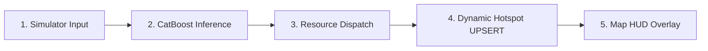
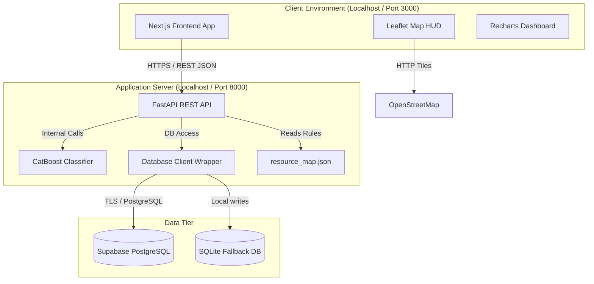
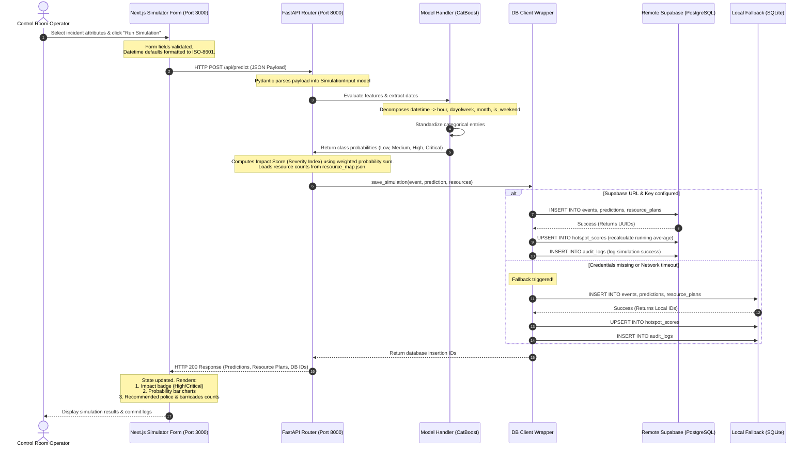

# Gridlock.AI - Traffic Incident Remediation & Predictive Dispatch Engine

An AI-driven operations command center designed to forecast traffic incident severity, map congestion hotspots, and automate remediation resource allocation (officers, barricades, and diversions) in metropolitan Bengaluru.

---

## 📂 Project Documentation Index

For detailed, deep-dive architectural documents, deployment guides, and training methodology, please refer to the files in the **[docs/](file:///c:/Users/vbhan/Downloads/flipkart-hack/docs/)** directory:

* **[docs/setup_guide.md](file:///c:/Users/vbhan/Downloads/flipkart-hack/docs/setup_guide.md)**: Local installation, database setup guide, and uvicorn/node.js startup logs.
* **[docs/model_approach.md](file:///c:/Users/vbhan/Downloads/flipkart-hack/docs/model_approach.md)**: CatBoost model selection rationale, Ordered Target Encoding preprocessor details, and the Impact Score mathematical formula.
* **[docs/system_architecture.md](file:///c:/Users/vbhan/Downloads/flipkart-hack/docs/system_architecture.md)**: Relational PostgreSQL schema details, optimization indexes, and module layouts.
* **[docs/detailed_architecture.md](file:///c:/Users/vbhan/Downloads/flipkart-hack/docs/detailed_architecture.md)**: Block diagrams, network port mappings, and API schemas.
* **[docs/production_roadmap.md](file:///c:/Users/vbhan/Downloads/flipkart-hack/docs/production_roadmap.md)**: Architectural enhancements for production, load balancers, caching, message brokers, and PostGIS scaling.
* **[docs/deployment_guide.md](file:///c:/Users/vbhan/Downloads/flipkart-hack/docs/deployment_guide.md)**: Pushing to GitHub, Web service configuration on Render, and client builds on Vercel.

---

## 1. Project Overview & Capabilities Matrix

Due to the physical constraints of the provided dataset, **Gridlock.AI** targets incident-based classification, severity forecasting, and historical hotspot analysis rather than direct time-series telemetry forecasting.

The table below outlines our model's current features based on the provided dataset versus our future scaling roadmap when extended physical sensors and operational logging telemetry are acquired.

### Dataset Capabilities Comparison

| Core Capability | Supported Now? | Method / Implementation |
| :--- | :---: | :--- |
| **Event Classification** | ✅ | Predicts incident types (Planned vs. Unplanned) based on road attributes. |
| **Event Severity Modeling** | ✅ | Classifies incidents into four severity bands: *Low*, *Medium*, *High*, and *Critical*. |
| **Road Closure Prediction** | ✅ | Identifies whether an incident necessitates physical road blockage. |
| **Hotspot Detection** | ✅ | Ranks and maps congestion junctions by running average incident index. |
| **Similar Event Retrieval** | ✅ | Fetches similar historical events to help dispatchers look up past resolutions. |
| **Impact Level Prediction** | ✅ | Extrapolates incident coordinates to project neighborhood impact. |
| **Traffic Volume Forecasting** | ❌ | *Requires continuous loop sensors/traffic camera counters (not in current dataset).* |
| **Speed Forecasting** | ❌ | *Requires real-time GPS telemetry from vehicle fleets (not in current dataset).* |
| **Congestion Index Prediction** | ❌ | *Requires continuous travel time telemetry across routes (not in current dataset).* |
| **Officer Dispatch Optimization** | ❌ | *Requires historical deployment logs with officer availability (no labels).* |
| **Barricade Optimization** | ❌ | *Requires physical equipment tracking logs (no labels).* |
| **Diversion Route Optimization** | ❌ | *Requires road network graph maps with active congestion weights (no labels).* |

---

## 2. How Gridlock.AI Works (End-to-End Workflow)

The platform evaluates, dispatches, and tracks incident-based congestion hotspots through a 5-step operational workflow:



1. **Incident Simulation (Dispatcher Input)**:
   * The operator logs an incident (Planned/Unplanned) on the frontend form, specifying coordinates, junction name, corridor, zone, road closure requirements, and the types of vehicles involved.
2. **AI Impact Evaluation (FastAPI + CatBoost)**:
   * The backend processes the input, extracts cyclical temporal variables (`hour`, `dayofweek`, `month`, `is_weekend`), and runs CatBoost evaluation. 
   * It calculates the **Severity Score (0.0 to 1.0)** based on the class probability matrix.
3. **Remediation Action Plan (Rules Engine)**:
   * Based on the predicted impact level (Low/Medium/High/Critical), the API reads the resource mapping engine (`resource_map.json`) to automatically allocate recommended quantities of **police officers**, **physical barricades**, and determine if a **road diversion** is mandatory.
4. **Dynamic Hotspot Scoring (PostgreSQL UPSERT)**:
   * The database client saves the transaction records. 
   * It performs an **UPSERT** on the `hotspot_scores` table for the junction: if the junction was targeted in previous incidents, the database dynamically updates the congestion index by calculating the **running average** of all historical severity scores and increments the incident count.
5. **Real-time Map HUD (Leaflet Visualization)**:
   * The frontend pulls the ranked hotspots and overlays circle markers on OpenStreetMap.
   * Circle radii and warning colors scale dynamically based on the calculated severity indices, highlighting active gridlock zones in real time.

---

## 3. Core Technological Stack

The platform is built using a modern, decoupled three-tier architecture:

* **Frontend**: Next.js App Router (React 19) styled with a clean, professional, and minimal SaaS design system (inspired by Vercel/Linear). Exposes a global Dark/Light mode toggle (persisted in `localStorage`), interactive Leaflet maps with custom CSS-inverted dark/light HUD overlays, and analytics charts powered by Recharts.
* **Backend**: FastAPI (Python 3.11) exposing asynchronous REST endpoints, automated Swagger OpenAPI documentation, and local/remote database synchronization.
* **Database**: Supabase (PostgreSQL) hosted in the cloud. It persists events, predictions, resource plans, hotspots, and audit logs. The backend also includes a **local SQLite fallback engine** that automatically instantiates and seeds a local DB if the cloud connection is offline.
* **Machine Learning**: CatBoost Classifier (`remediated_traffic_model.cbm`) running in-process inside the FastAPI application, executing predictions in under 10 milliseconds.

---

## 4. System Modules & Approaches

### 1. The Machine Learning Engine (CatBoost)
* **Categorical Boosting**: We selected CatBoost because our geographic datasets are dominated by high-cardinality categorical attributes (`junction`, `zone`, `corridor`). Instead of sparse one-hot encoding, CatBoost handles categories natively using **Ordered Target Encoding**.
* **Continuous Severity Score**: Rather than returning static classes, the model extracts the class probabilities and calculates a continuous **Severity Index (0.0 to 1.0)**:
  $$\text{Impact Score} = (0.1 \times P(\text{Low})) + (0.4 \times P(\text{Medium})) + (0.75 \times P(\text{High})) + (1.0 \times P(\text{Critical}))$$
  This allows control room operators to rank and prioritize hotspots with mathematical precision.

### 2. The Cloud Database (Supabase PostgreSQL)
* Implements a relational database schema mapping:
  * `events` (incident context) ➔ `predictions` (model output) ➔ `resource_plans` (allocated assets).
* Auto-calculates running average congestion scores on the `hotspot_scores` table using backend **UPSERT** transactions.
* Records system logs inside the `audit_logs` table for administrative verification.

### 3. The Backend API (FastAPI)
Exposes the following JSON endpoints:
* `POST /api/predict` — accepts coordinates and incident attributes, runs inference, saves records, and returns recommendations.
* `GET /api/history` — retrieves past simulations.
* `GET /api/hotspots` — returns coordinates and severity scores for Leaflet.
* `GET /api/analytics` — compiles charts and KPI metrics.
* `GET /api/audit-logs` — provides system audit trails.

---

## 5. Local Setup & Execution Guide

Follow these steps to launch the entire platform on your local machine:

### Prerequisites
Make sure you have **Node.js (v16+)** and **Python (v3.8 - v3.11)** installed on your system.

### Option A: The Windows Automated Launcher
Double-click the **`start_servers.bat`** file in the root directory. The script will:
1. Verify Node and Python paths.
2. Install Python dependencies and launch the backend on [http://localhost:8000](http://localhost:8000).
3. Start the Next.js dev server on [http://localhost:3000](http://localhost:3000).

---

### Option B: Manual Startup

#### 1. Start the Backend API
```bash
cd backend
python -m pip install -r requirements.txt
python -m uvicorn main:app --reload --port 8000
```
*Note: If no Supabase credentials are set in `backend/.env`, the server will automatically default to `gridlock_local.db` (SQLite) and seed the schema.*

#### 2. Start the Next.js Frontend
```bash
cd ../frontend
npm install
npm run dev
```

#### 3. Open your Browser
* **Frontend Command Center**: [http://localhost:3000](http://localhost:3000)
* **Backend Swagger Documentation**: [http://localhost:8000/docs](http://localhost:8000/docs)

---

## 6. End-to-End System Architecture Diagrams

### System Block Diagram


### Transaction Sequence Flow (Prediction Lifecycle)

