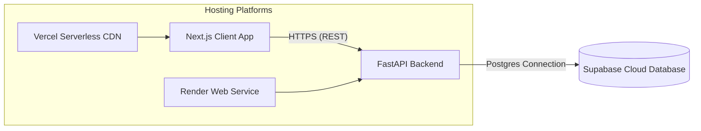

# Production Deployment Guide

This guide provides step-by-step instructions to deploy the **Gridlock.AI** platform to production environments.

---

## Deployment Architecture Overview

Since the application uses a split-stack design, we will deploy the frontend and backend separately to cloud platforms. The database is already cloud-hosted via Supabase.



---

## Step 1: Push Project to GitHub

Both Vercel and Render deploy automatically by linking to a GitHub repository.

1. Create a new repository on [GitHub](https://github.com).
2. Initialize Git in your project root, commit files, and push to GitHub:
   ```bash
   git init
   git add .
   git commit -m "feat: stable release of Gridlock.AI"
   git branch -M main
   git remote add origin https://github.com/yourusername/your-repo-name.git
   git push -u origin main
   ```

> [!WARNING]
> Ensure that the root `.gitignore` file is committed. This prevents your active database keys in `backend/.env` and temporary build/dependencies from leaking to public GitHub repositories.

---

## Step 2: Deploy FastAPI Backend (Render)

We will use **Render** (render.com) to host the Python FastAPI service.

### 1. Account Setup
* Go to [Render](https://render.com) and sign up/log in (using GitHub is recommended).

### 2. Configure the Web Service
* Click **New +** at the top right and select **Web Service**.
* Connect your GitHub account and select your repository.
* Configure the settings exactly as follows:
  
  | Configuration Field | Recommended Value |
  | :--- | :--- |
  | **Name** | `gridlock-backend` (or a name of your choice) |
  | **Environment** | `Python` |
  | **Region** | Select a region closest to your user base |
  | **Branch** | `main` |
  | **Root Directory** | **`backend`** *(CRITICAL: This tells Render to run pip and start inside the backend folder rather than the root directory)* |
  | **Build Command** | `pip install -r requirements.txt` |
  | **Start Command** | `uvicorn main:app --host 0.0.0.0 --port $PORT` |
  | **Instance Type** | `Free` |

### 3. Add Environment Variables
* Click **Advanced** to expand options, and add the following keys under the **Environment Variables** section:

  | Variable Name | Value | Description |
  | :--- | :--- | :--- |
  | `USE_LOCAL_DB` | `false` | Instructs the backend to connect to Supabase instead of SQLite |
  | `SUPABASE_URL` | *(Your Supabase URL)* | The Project URL from Supabase settings |
  | `SUPABASE_KEY` | *(Your service_role Key)* | The private secret token from Supabase settings |

### 4. Deploy and Retrieve URL
* Click **Create Web Service**. Render will build and deploy the application.
* Once the build completes and displays "Live", copy the public URL located at the top of the Render panel (e.g., `https://gridlock-backend.onrender.com`).

> [!NOTE]
> **Render Free Tier Spin-up Warning**: Services deployed on Render's free tier automatically go to sleep after 15 minutes of inactivity. When a user calls the page after a period of inactivity, Render takes 50–90 seconds to reboot the instance. During evaluations, open the backend link once beforehand to trigger a reboot and avoid lag!

---

## Step 3: Deploy Next.js Frontend (Vercel)

We will use **Vercel** (vercel.com) to host the Next.js frontend app.

### 1. Project Import
* Go to [Vercel](https://vercel.com) and sign in with your GitHub account.
* Click **Add New** -> **Project**.
* Import your project repository.

### 2. Configure Framework and Directories
* Vercel will automatically detect `Next.js` as the framework.
* Expand the **Root Directory** setting, click *Edit*, select the **`frontend`** directory, and click *Continue*. *(CRITICAL: This directs Vercel to install dependencies and run Next.js compilation inside the frontend folder).*

### 3. Add Environment Variables
Next.js requires client-side variables to be explicitly prefixed so they are compiled into the browser bundle. Expand the **Environment Variables** section and add the following variable:

> [!IMPORTANT]
> The environment variable **MUST** be named exactly **`NEXT_PUBLIC_API_URL`** (with the `NEXT_PUBLIC_` prefix). If you omit the prefix, Next.js will block the browser from reading the API URL, causing API calls to crash at runtime.

| Name | Value |
| :--- | :--- |
| **`NEXT_PUBLIC_API_URL`** | *(Your public Render backend URL copied in Step 2, e.g., `https://gridlock-backend.onrender.com`)* |

### 4. Deploy
* Click **Deploy**.
* Vercel will compile and deploy the Next.js frontend in 1-2 minutes.
* You will receive a production deployment link (e.g., `https://gridlock-frontend.vercel.app`).

---

## Step 4: Verify Production Infrastructure

1. Open your Vercel frontend URL in a browser.
2. Verify the status indicator in the top-right header:
   * It should display **API: ONLINE** (indicating it has successfully connected to the Render backend).
3. Open the **Event Simulator** panel:
   * Populate a sample traffic incident (e.g., *SilkBoardJunc*, vehicle breakdown, requires road closure).
   * Click **Run Predictive Simulation**.
   * Confirm that prediction meters, confidence scores, and recommended police/barricade plans display correctly.
4. Go to the **Admin Panel**:
   * Verify that **Database Connection** reads **Remote Supabase** and check the live audit stream logs.
5. Log into your **Supabase Dashboard**:
   * Open the table editor for `events` and verify that your simulated incident record was saved successfully in PostgreSQL.
