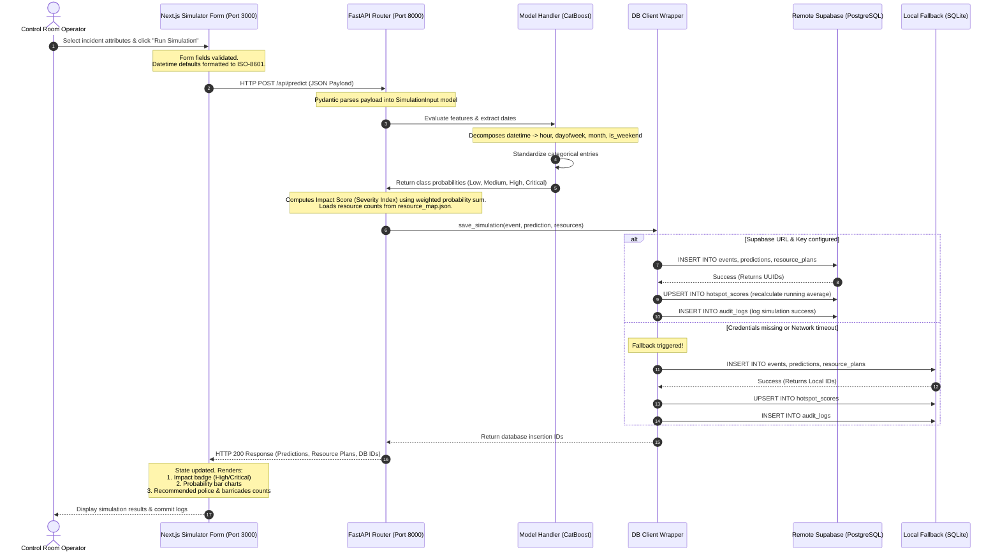

# Detailed System Architecture & Data Flow

This document provides a highly granular walkthrough of the physical, logical, and transactional architecture of **Gridlock.AI**, showing component communication, APIs, and data structures.

---

## 1. Physical Architecture (Deployment Layout)

The physical architecture defines how components are hosted, their ports, and their network protocols.

```mermaid
flowchart TB
    subgraph Client_Browser [Client Environment (Localhost)]
        FE_APP[Next.js Frontend App<br/>Port 3000]
        LEAFLET[Leaflet Map HUD]
        RECHARTS[Recharts Dashboard]
    end

    subgraph Backend_Server [Application Server (Localhost)]
        API_ROUTER[FastAPI REST API<br/>Port 8000 / Uvicorn]
        MODEL_INF[CatBoost Classifier<br/>In-Process Model Loader]
        DB_CONNECTOR[Database Client Wrapper<br/>supabase-py / sqlite3]
        RESOURCES[resource_map.json<br/>Static Allocation Rules]
    end

    subgraph Data_Storage [Data Tier]
        SUPABASE[(Supabase PostgreSQL<br/>Port 5432 / AWS Hosted)]
        SQLITE[(SQLite Fallback DB<br/>gridlock_local.db)]
    end

    %% Network Protocols
    FE_APP -- "HTTPS / REST JSON" --> API_ROUTER
    LEAFLET -- "HTTP (Tile Requests)" --> OpenStreetMap[OpenStreetMap Servers]
    API_ROUTER -- "Internal Method Calls" --> MODEL_INF
    API_ROUTER -- "Reads Local Settings" --> RESOURCES
    API_ROUTER -- "DB Reads & Writes" --> DB_CONNECTOR
    
    DB_CONNECTOR -- "TLS / PostgreSQL Protocol" --> SUPABASE
    DB_CONNECTOR -- "Direct File Access (fallback)" --> SQLITE
```

---

## 2. Logical Block Diagram (Software Modules)

The logical architecture breaks down the components of each layer and lists their specific code files.

```mermaid
flowchart LR
    subgraph NextJS_Frontend [Next.js App Router Structure]
        direction TB
        L[layout.js - Main Layout & Sidebar]
        P[page.js - Operations Dashboard]
        S[simulator/page.js - Input Form & Meters]
        M[map/page.js - Interactive Leaflet Map]
        A[analytics/page.js - Recharts Analytics]
        H[history/page.js - Audit Stream Table]
        AD[admin/page.js - Latency & Status Center]
        CSS[globals.css - HSL CSS variables & Custom Glows]
    end

    subgraph FastAPI_Backend [FastAPI Backend Service]
        direction TB
        MAIN[main.py - Router Endpoints]
        MH[model_handler.py - Preprocessor & Predictor]
        DBC[db_client.py - DB Handler & Fallback Engine]
        CBM[remediated_traffic_model.cbm - CatBoost Model File]
        RES[resource_map.json - Static Mapping Rules]
        ENV[.env - Connection Settings]
    end

    NextJS_Frontend -- "REST API" --> FastAPI_Backend
```



---

## 3. Detailed Data Transaction Sequence (Simulation Lifecycle)

When an operator creates a new incident simulation, the transaction lifecycle proceeds as follows:



---

## 4. API Endpoints Reference & Schemas

### 1. `POST /api/predict`
Ingests raw incident reports, runs CatBoost evaluation, persists records, and returns recommendations.

* **Request Payload Format (`application/json`)**:
  ```json
  {
    "event_type": "unplanned",
    "event_cause": "accident",
    "requires_road_closure": true,
    "veh_type": "heavy_vehicle",
    "corridor": "Hosur Road",
    "zone": "South Zone 1",
    "junction": "SilkBoardJunc",
    "latitude": 12.9176,
    "longitude": 77.6244,
    "start_datetime": "2026-06-21T17:00:00.000Z",
    "closed_datetime": "2026-06-21T18:00:00.000Z"
  }
  ```

* **Response Payload Format (`application/json`)**:
  ```json
  {
    "success": true,
    "prediction": {
      "predicted_impact_level": "High",
      "impact_score": 0.6335,
      "probabilities": {
        "Critical": 0.2295,
        "High": 0.4054,
        "Low": 0.1762,
        "Medium": 0.1890
      }
    },
    "recommendation": {
      "police_required": 10,
      "barricades_required": 20,
      "diversion_strategy": "Required"
    },
    "database_records": {
      "event_id": "1818b098-b2cc-4938-8761-ac193a25f168",
      "prediction_id": "49b9ef43-4663-4938-b2ca-d5e7cd37101f",
      "resource_plan_id": "dd5ed1a4-5043-4cf9-95b8-5454abbc2404"
    }
  }
  ```

---

### 2. `GET /api/history`
Fetches a list of past simulated incidents for audit streaming and data log views.
* **Query Parameters**: `limit` (integer, default 50)
* **Response**: Contains a flattened list of incidents including predicted severity levels and resource counts.

---

### 3. `GET /api/hotspots`
Fetches geographic data points and cumulative severity indexes to feed Leaflet mapping markers.
* **Query Parameters**: `limit` (integer, default 100)
* **Response**: List of coordinates, junction names, cumulative severity scores, and incident counts.

---

### 4. `GET /api/analytics`
Fetches pre-calculated aggregations, category ratios, hourly peak arrays, and average clearance intervals.
* **Response**:
  ```json
  {
    "success": true,
    "data": {
      "total_events": 12,
      "allocated_police": 65,
      "allocated_barricades": 130,
      "avg_duration": 48.5,
      "severity_distribution": { "Low": 2, "Medium": 4, "High": 5, "Critical": 1 },
      "hourly_distribution": { "9": 3, "17": 5, "18": 4 },
      "cause_distribution": { "accident": 6, "water_logging": 4, "construction": 2 }
    }
  }
  ```
