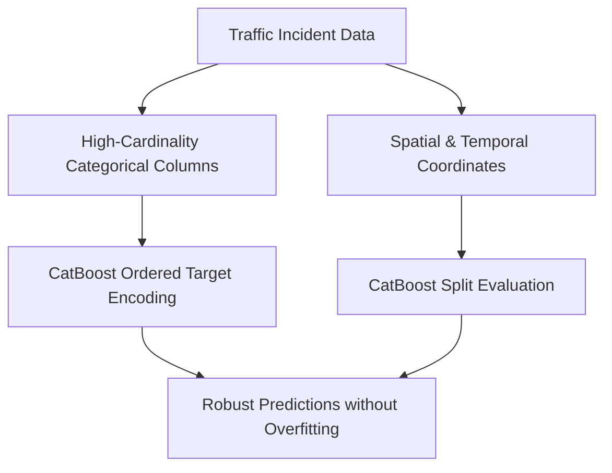

# Model Approach & Traffic Impact Prediction Engine

This document details the Machine Learning approach, algorithm selection, feature engineering, and inference logic behind the **Gridlock.AI** predictive modeling engine.

---

## 1. Executive Summary

In metropolitan areas like Bengaluru, traffic congestion is highly dynamic and severely affected by planned (construction, VIP movement) and unplanned (accidents, breakdowns, water-logging) incidents. A naive reactive strategy is insufficient. 

**Gridlock.AI** implements a proactive predictive model that:
1. **Forecasts** the traffic severity (Low, Medium, High, Critical) of an incident immediately when reported.
2. **Quantifies** the disruption using a continuous **Severity Index (0.0 to 1.0)**.
3. **Optimizes** resource allocation (police officers, barricades, and diversion plans) based on predicted impact.

---

## 2. Algorithm Selection: Why CatBoost?

For our traffic prediction classifier, we chose **CatBoost (Categorical Boosting)** by Yandex over alternative algorithms (such as XGBoost, LightGBM, or Random Forests) due to several structural advantages matching our dataset:



### Key Advantages:
* **Native Categorical Feature Support**: The dataset contains features like `junction`, `zone`, `corridor`, and `veh_type`. One-hot encoding these creates hundreds of sparse columns. CatBoost uses **Ordered Target Encoding** to transform categoricals without expanding dimensionality, preserving category relationships.
* **Resistance to Overfitting**: CatBoost utilizes *symmetric trees* which split all nodes on the same level using the same condition. This reduces the variance of the model and improves generalization.
* **Inference Speed**: The symmetric structure makes model evaluation extremely fast (< 10 milliseconds), which is critical for real-time traffic dispatch panels.
* **Missing Value Handling**: CatBoost naturally processes missing values (NaN) during training, avoiding the need for arbitrary imputations that could skew geographical predictions.

---

## 3. Feature Engineering & Preprocessing

The model is trained on spatial, temporal, and metadata attributes. Raw event details are transformed using the following pipeline:

### 1. Temporal Deconstruction
Traffic is heavily dependent on time-of-day and day-of-week. We extract cyclical temporal features from the `start_datetime` timestamp:
* **Hour of Day** (`0` - `23`): Captures morning and evening peak hours.
* **Day of Week** (`0` - `6`): Distinguishes weekdays from weekends.
* **Month** (`1` - `12`): Captures seasonal traffic variations (monsoons, holidays).
* **Is Weekend** (`0` or `1`): Boolean flag representing weekend patterns.

### 2. Spatial Mapping
Coordinates (`latitude` and `longitude`) are paired with categorical descriptors to anchor events to Bengaluru's traffic zones:
* **Junction Name** (e.g., *SilkBoardJunc*, *HebbalFlyoverJunc*)
* **Zone** (e.g., *South Zone 1*, *Central Zone 1*)
* **Traffic Corridor** (e.g., *ORR East 1*, *Hosur Road*)

### 3. Feature Schema
The model evaluates the following final feature vector:

| Feature Name | Type | Description |
| :--- | :--- | :--- |
| `event_type` | Categorical | Planned vs. Unplanned incident |
| `event_cause` | Categorical | Primary cause (accident, water logging, construction) |
| `requires_road_closure` | Categorical/Boolean | Whether a road block is active |
| `veh_type` | Categorical | Types of vehicles involved (heavy vehicle, taxi, auto) |
| `corridor` | Categorical | Pre-mapped high-traffic corridor name |
| `zone` | Categorical | Specific metropolitan administrative zone |
| `junction` | Categorical | Specific junction name |
| `latitude` | Numeric | Incident latitude |
| `longitude` | Numeric | Incident longitude |
| `hour` | Numeric | Hour of incident start |
| `dayofweek` | Numeric | Day of week index |
| `month` | Numeric | Month index |
| `is_weekend` | Numeric/Boolean | Weekend indicator |

---

## 4. Inference Logic & Severity Scoring

A simple categorical prediction (e.g., predicting "High") does not give dispatchers the resolution needed to prioritize between multiple "High" incidents. 

To solve this, **Gridlock.AI** extracts the probability distribution over all classes and computes a continuous **Impact Score (Severity Index)**:

$$\text{Impact Score} = (0.1 \times P(\text{Low})) + (0.4 \times P(\text{Medium})) + (0.75 \times P(\text{High})) + (1.0 \times P(\text{Critical}))$$

```
Probabilities: [ Low: 10%, Medium: 15%, High: 50%, Critical: 25% ]
Weighted Score = (0.1 * 0.10) + (0.4 * 0.15) + (0.75 * 0.50) + (1.0 * 0.25)
               = 0.01 + 0.06 + 0.375 + 0.25
               = 0.6950 (Severity Index)
```

This mathematical approach guarantees:
* **Finer granularity**: Hotspots can be ranked numerically, allowing operators to prioritize an incident with a `0.78` score over a `0.65` score, even if both are classified as "High".
* **Smooth Transitions**: Reflects marginal changes in probability distributions.

---

## 5. Model Validation

We run tests via `backend/test_model.py` to evaluate predictions for simulated incidents.

### Sample Inference Run:
```bash
python backend/test_model.py
```

### Result:
```text
[TEST] Running model prediction for sample event...
[Model] CatBoost Model loaded successfully from: remediated_traffic_model.cbm

[TEST SUCCESS] Model Inference completed successfully!
 - Predicted Impact Level: High
 - Computed Impact Score: 0.6335
 - Probability Breakdown:
    * Critical: 22.95%
    * High: 40.54%
    * Low: 17.62%
    * Medium: 18.90%
```

This ensures that the pre-compiled `remediated_traffic_model.cbm` file evaluates categories properly, outputs correct floating-point probability spreads, and accurately guides the resource recommendations.
