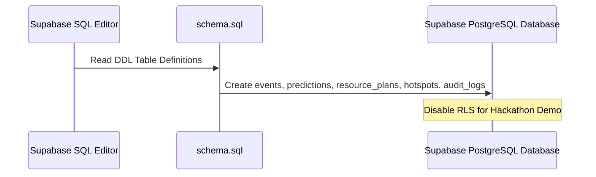

# Comprehensive Setup & Execution Guide

Follow these step-by-step instructions to configure, run, and verify the **Gridlock.AI** Traffic Remediation and Prediction platform.

---

## 1. Prerequisites

Before starting, ensure you have the following software installed on your system:
* **Python (v3.8 or higher)**: [Download Python](https://www.python.org/downloads/) (Make sure to check "Add Python to PATH" during installation).
* **Node.js (v16.0 or higher) & npm**: [Download Node.js](https://nodejs.org/).
* **Supabase Account**: A free account at [Supabase](https://supabase.com/).

---

## 2. Remote Database Setup (Supabase)

Gridlock.AI uses **Supabase** (PostgreSQL) to persist events, predictions, resource plans, hotspots, and audit logs.



### Steps:
1. **Create a Project**: 
   * Log into Supabase and click **New Project**.
   * Give it a name (e.g., `Gridlock-Remediation`), set a secure database password, choose a server region close to your users, and click **Create**.
2. **Execute Schema SQL**:
   * Navigate to the **SQL Editor** tab (terminal icon) on the left sidebar in your Supabase dashboard.
   * Click **New Query**.
   * Copy the content of the schema script located at [backend/schema.sql](file:///c:/Users/vbhan/Downloads/flipkart-hack/backend/schema.sql).
   * Paste the script into the SQL Editor and click **Run**.
3. **Important: Disable Row Level Security (RLS)**:
   * To simplify hackathon evaluations, run the following SQL script to disable RLS on your tables:
     ```sql
     ALTER TABLE public.events DISABLE ROW LEVEL SECURITY;
     ALTER TABLE public.predictions DISABLE ROW LEVEL SECURITY;
     ALTER TABLE public.resource_plans DISABLE ROW LEVEL SECURITY;
     ALTER TABLE public.hotspot_scores DISABLE ROW LEVEL SECURITY;
     ALTER TABLE public.audit_logs DISABLE ROW LEVEL SECURITY;
     ```

---

## 3. Retrieve Credentials & Configure Environment

You must link your FastAPI backend to your Supabase project.

1. Go to **Project Settings** (gear icon ⚙️) in your Supabase dashboard.
2. Select the **API** tab under Configuration.
3. Locate and copy:
   * **Project URL** (e.g., `https://abcdefghijkl.supabase.co`)
   * **service_role key (Secret)** (Starts with `eyJhb...` under the *Legacy API keys* tab or `sb_secret_...` under new keys. Copy the `service_role` key, which has bypass privileges for RLS).
4. Configure the Backend environment:
   * Open the configuration file [backend/.env](file:///c:/Users/vbhan/Downloads/flipkart-hack/backend/.env).
   * Update the variables as shown below:
     ```ini
     # Server configuration
     HOST=0.0.0.0
     PORT=8000

     # Database Configuration (Set to false to use Supabase)
     USE_LOCAL_DB=false

     # Supabase Credentials
     SUPABASE_URL=https://your-project-id.supabase.co
     SUPABASE_KEY=your-service-role-key-token-here
     ```

> [!NOTE]
> If `SUPABASE_URL` or `SUPABASE_KEY` is left blank, the backend will automatically fallback to a local SQLite database (`gridlock_local.db`) and seed its tables.

---

## 4. Running the Platform

There are two methods to launch the application:

### Option A: The Fast Windows Launcher (Recommended)
1. Navigate to the root directory of the project in File Explorer.
2. Double-click the launcher script [start_servers.bat](file:///c:/Users/vbhan/Downloads/flipkart-hack/start_servers.bat).
3. The script will automatically inspect your environment, install missing Python packages (`fastapi`, `supabase`, `catboost`, etc.), compile frontend components, and launch both backend and frontend servers in separate terminal consoles.

---

### Option B: Manual Execution
If you prefer running commands manually:

#### 1. Ingest & Run FastAPI Backend:
```bash
cd backend
python -m pip install -r requirements.txt
python -m uvicorn main:app --reload --port 8000
```
*The backend API documentation will be available at: http://localhost:8000/docs*

#### 2. Build & Launch Next.js Frontend:
```bash
cd ../frontend
npm install
npm run dev
```
*The frontend dashboard will be available at: http://localhost:3000*

---

## 5. Verification & Testing

### Test Model Evaluation Script
Confirm the CatBoost prediction engine is loaded and executing inference:
```bash
python backend/test_model.py
```
If configured correctly, the terminal will print a successful prediction output showing a high impact index.

### End-to-End Simulation
1. Open [http://localhost:3000](http://localhost:3000) in your browser.
2. Navigate to the **Event Simulator** page in the left sidebar.
3. Choose an incident junction (e.g., `SilkBoardJunc`), choose the vehicle type, input the incident cause, and click **Run Predictive Simulation**.
4. The dashboard will show the predicted impact levels, display resource recommendations, and verify that the transaction was written to your remote database.
