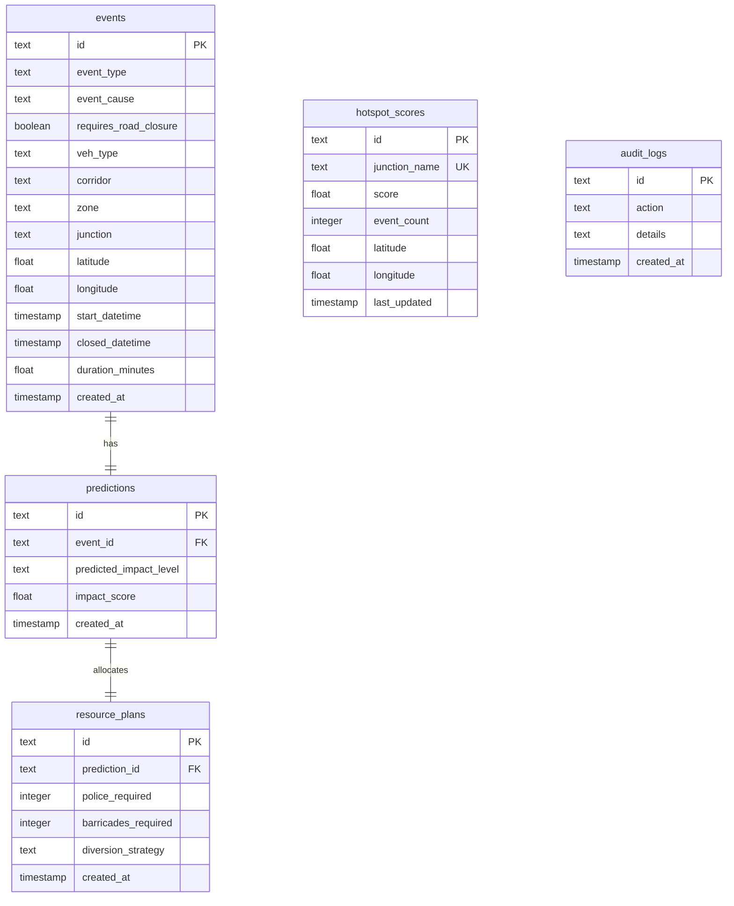

# Prototype System Architecture & Technology Stack

This document details the architectural layout, modular design, technology choices, database structure, and communication protocols of the **Gridlock.AI** platform.

---

## 1. High-Level Architecture Overview

The Gridlock.AI application is built on a decoupled, multi-tier microservices architecture designed to scale ML predictions, database transactions, and client dashboards independently.

```mermaid
flowchart TD
    subgraph Client Layer (Next.js)
        FC[Operations Dashboard] <--> FM[Leaflet Hotspot Map]
        FS[Incident Simulator] <--> FA[Recharts Analytics]
    end

    subgraph API Router & ML Compute (FastAPI)
        BE[FastAPI Router] <--> MH[CatBoost Model Handler]
        BE <--> DBC[Supabase/SQLite DB Client]
        MH <--> MD[remediated_traffic_model.cbm]
    end

    subgraph Data Store Layer (Supabase)
        SDB[(PostgreSQL Database)]
    end

    FC & FM & FS & FA -- REST HTTP Requests --> BE
    DBC -- Service Role Token (Bypasses RLS) --> SDB
```

---

## 2. Technology Stack Choices

| Technology | Layer | Rationale |
| :--- | :--- | :--- |
| **Next.js 16 (React 19)** | Frontend | App Router layout for routing, server-side pre-rendering optimizations, and native states. |
| **Vanilla CSS** | Styling | Styled with custom HSL color systems, card glassmorphic shadows, and custom keyframe animations. |
| **FastAPI** | Backend | High-performance asynchronous execution loop, automated OpenAPI documentation generation, and native integration with Python libraries. |
| **CatBoost Model** | Machine Learning | Encoded prediction model utilizing categorical ordered boosting. Extracted class probability maps to compute continuous severity index. |
| **Supabase (PostgreSQL)** | Database | Multi-index SQL queries, instant cloud-hosted PostgreSQL, relational tables, and audit logs. |
| **Leaflet & React-Leaflet** | Map Overlay | Spatial coordinate plotting, dark-HUD map filtering, and circle markers sized dynamically by severity indices. |
| **Recharts** | Data Analytics | SVG-rendered, interactive responsive charts for hourly incident peaks and categorical distributions. |

---

## 3. Database Schema Design (PostgreSQL)

The database consists of 5 highly correlated tables with indexes on critical query paths:



### Table Index Optimization:
* Index on `events.junction` & `events.zone` to accelerate regional filters.
* Index on `predictions.predicted_impact_level` to accelerate analytics aggregation.
* Unique Constraint on `hotspot_scores.junction_name` allowing quick **UPSERTs** (running average score computed inside backend transactions).

---

## 4. Modular Codebase Layout

```text
flipkart-hack/
├── backend/
│   ├── main.py              # FastAPI endpoints & CORS
│   ├── model_handler.py     # CatBoost loading & preprocessor
│   ├── db_client.py         # DB connection wrapper (Supabase / SQLite)
│   ├── schema.sql           # PostgreSQL table DDL & indexing script
│   ├── requirements.txt     # Python backend dependencies
│   └── test_model.py        # Independent model pipeline validation
├── frontend/
│   ├── public/              # Static assets
│   ├── src/app/
│   │   ├── components/      # Sidebar & Leaflet Map loader
│   │   ├── simulator/       # Form fields & Prediction outputs
│   │   ├── map/             # Hotspot Coordinate dark map
│   │   ├── analytics/       # Recharts distribution visuals
│   │   ├── history/         # Searchable table log
│   │   ├── admin/           # Latency check & Audit logs
│   │   ├── globals.css      # Custom HSL dark design system
│   │   └── page.js          # Core overview KPI cards
│   ├── package.json         # Node.js dependencies
│   └── next.config.mjs      # Next.js configurations
└── start_servers.bat        # Windows automation server startup script
```

---

## 5. End-to-End API Data Flow

When a user submits parameters on the **Incident Simulator** dashboard:

1. **HTTP POST Request**: The frontend compiles input values and fires a JSON payload to `POST /api/predict`.
2. **Preprocessing**: The backend receives the payload. `model_handler.py` decomposes the time stamp into `hour`, `dayofweek`, `month`, and `is_weekend`, appending them to the feature list.
3. **CatBoost Inference**: The CatBoost model executes. It evaluates categories and spits out class probabilities (Low, Medium, High, Critical).
4. **Severity Scoring**: The server processes the probabilities, computes the continuous **Impact Score (0.0 to 1.0)**, and extracts resource plans from `resource_map.json`.
5. **Database Transaction**: `db_client.py` writes three records across `events`, `predictions`, and `resource_plans`. It updates the junction's cumulative score inside `hotspot_scores` and writes an audit log entry.
6. **Unified JSON Response**: The backend returns the computed prediction, recommendations, and DB record IDs back to the browser in under 30 milliseconds.
